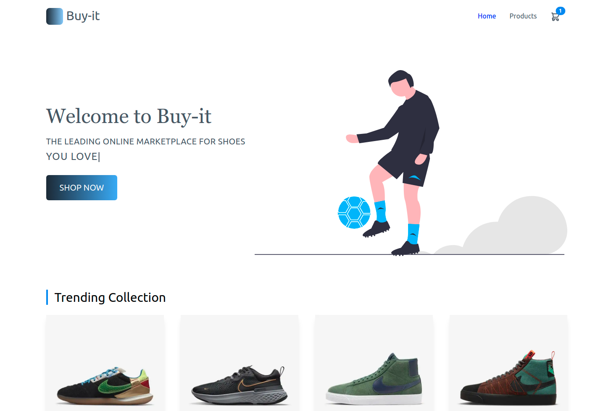
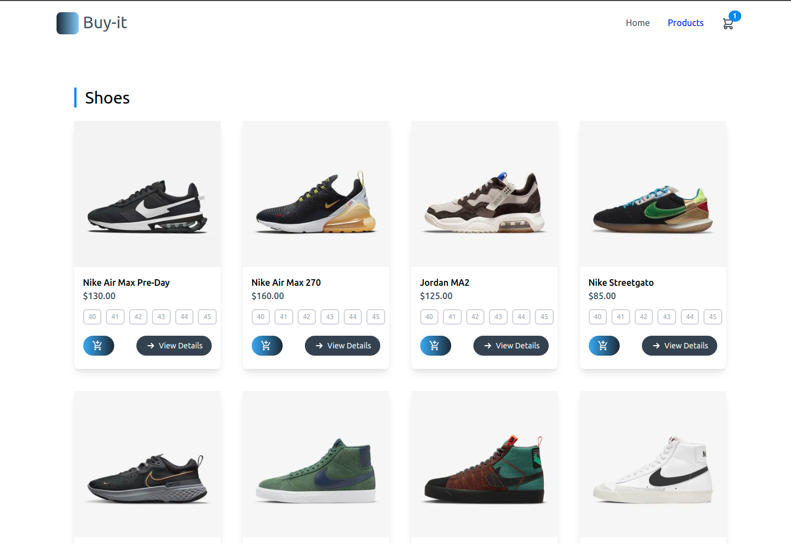
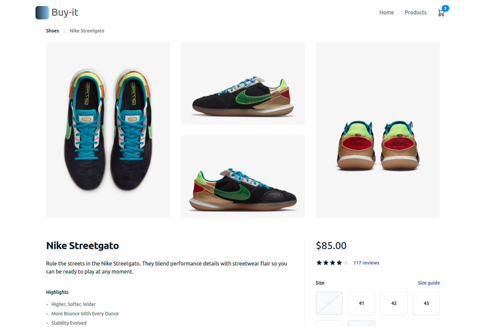
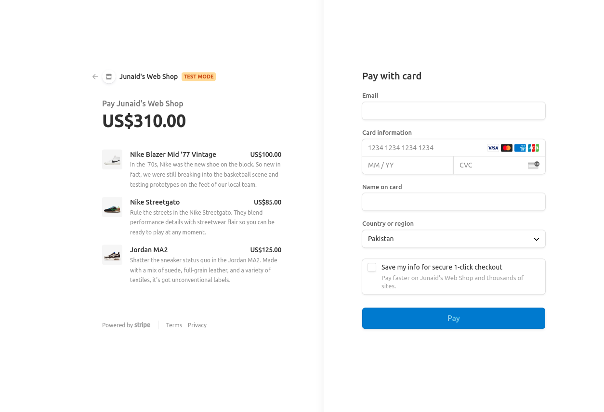
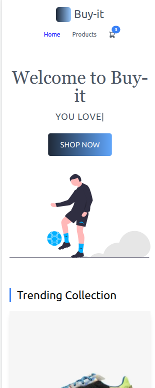

# Buyit E-commerce Website

### _E-commerce website developed using (GatsbyJs + TailwindCSS + GraphQl + Stripe + Netlify Serverless Functions) !!_

### Video :link: https://youtu.be/LiXNgtxwBEk

### Link :link: https://buyit-shoes.netlify.app/

## Desktop

## Mobile

## Run Locally

- Run this command `git clone https://github.com/developer-junaid/Buy-It.git`
- You are now in the dev environment and you can play around

## Tech Stack

- GatsbyJs
- TailwindCss
- GraphQl
- Netlify Serverless Functions
- Stripe (Payment Gateway and DB)
